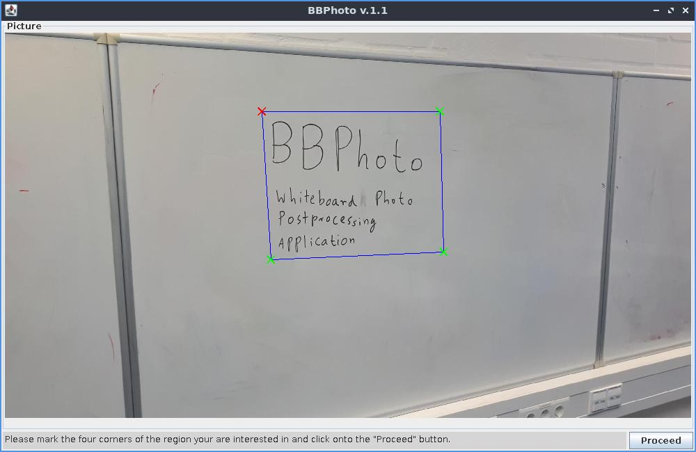
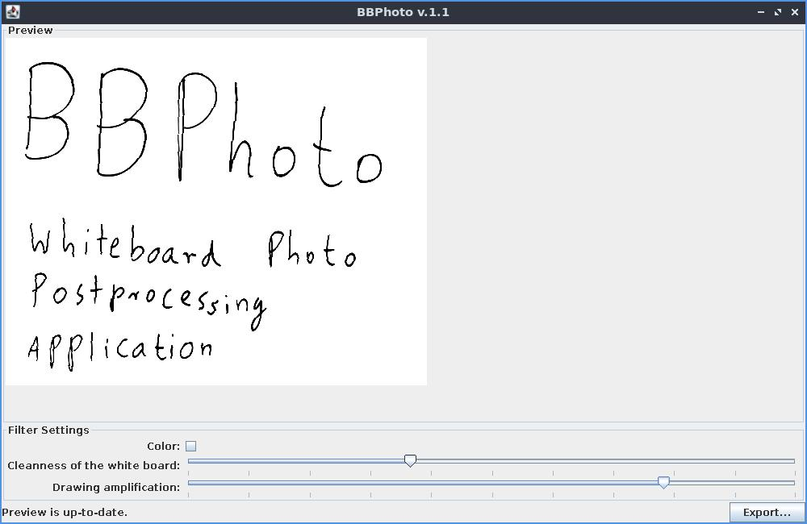
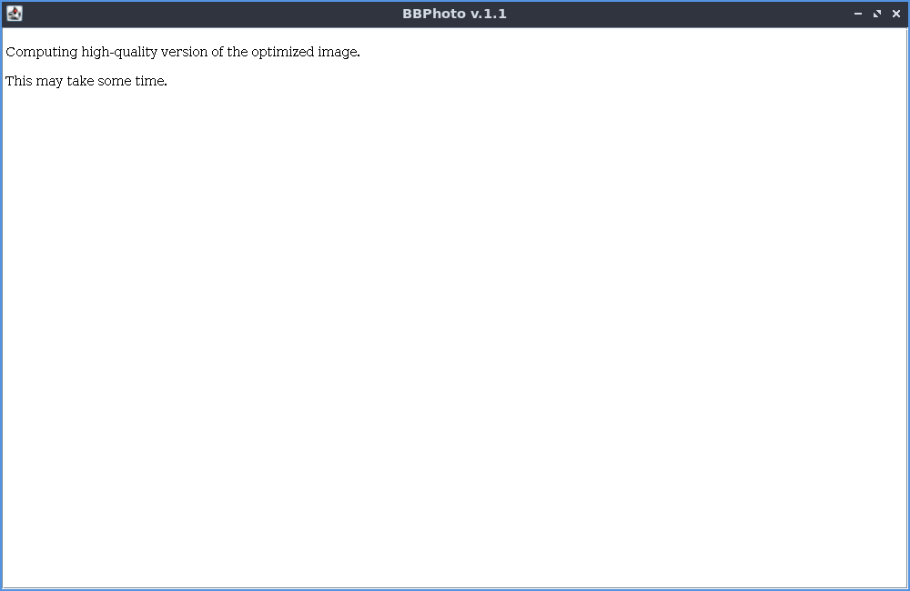
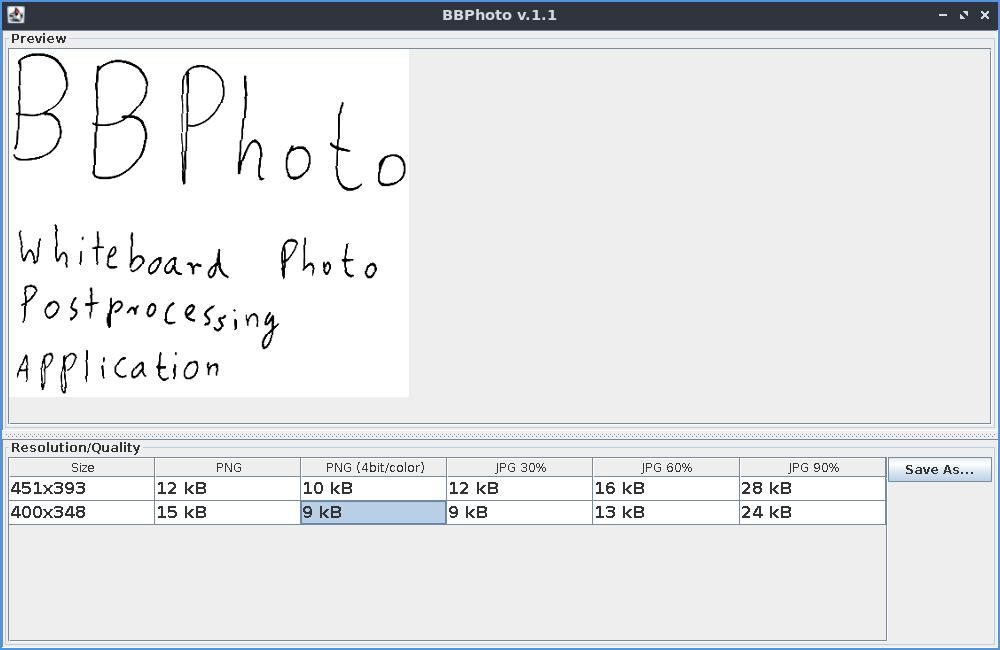

# BBPhoto

A Semi-automatic cleaning program for whiteboard photos. It is able to interface gphoto2 under Linux.

## A quick tour through the user interface

The program uses a wizard-like user interface with four views overall.

**View 1:** On the first view, you select the part of the input image that you want to process.

**View 2:** Afterwards, the user can choose some parameter values that influence how the color saturation step that makes the background of the image fully white work. They should be adapted based on the cleanliness of the whiteboard and the lighting when making the photograph. After each setting change, the preview is updated.

**View 3:** This is just a "Please wait view" while the final image in full resolution is computed.

**View 4:** In this fourth and final view, the user can select a particular image output format/resolution combination based on a live preview of the resulting image quality and the sizes of the computed image files. The image sizes and previews are computed in the background while this view is shown.

Note that this program does not have forward *and* backward buttons currently, and the program behavior after adding backwards buttons has been a case study in two scientific papers about the reactive synthesis of program code for graphical user interface.

## Installation

BBPhoto is written in Java 6. To build the program, either (1) compile it with the "ant" tool by running "ant" in the checked out repository, or (2) import it as a project in the IDE Netbeans and use the build command from Netbeans. The file "dist/BBPhoto.jar" will be created as a result.

## Starting BBPhoto

There are two modes of operations for the BBPhoto program.

- By running BBPhoto without a JPEG file as an argument, it tries to use the "gphoto2" tool to download the latest picture from a Camera that is connected to the computer. 
- By running BBPhoto with a JPEG file as a command line argument, the JPEG file will be used as input.

In both cases, the command to start it is "java -Xmx512m -jar BBPhoto.jar" plus the optional file name. The tool comes with a graphical user interface (GUI). Currently, there is no option to use the program without the GUI.

## Using BBPhoto

The first screen of BBPhoto will display a point selection interface. Here, you can select the boundaries of the part of the image that you want to use. Start with the top left corner and proceed clockwise. After four points have been selected, the "Proceed" button in the lower right corner of the image becomes active. Clicking it will let you proceed to the image quality setting menu. Use the two sliders to adjust the image quality. Whenever a new slider setting has been selected, the preview image above the sliders gets updated. This may take a few seconds. Click on "Proceed" to confirm the selection.

Afterwards, a "please wait" information box is shown while a full-resolution version of the processed image is computed. For very large images, this can take up to the order of minutes even on modern computers. Afterwards, a resolution selection window is shown. It allows you to select a scaled down resolution of the processed image along with a file format. The preview shows how large the resulting file will be. Selecting a file type/resolution combination and clicking on the "Save" button allows to write the image to file.

When closing the window after saving a file *and* starting BBPhoto without a file name, the tool displays a dialog box to ask the user whether the last image on the camera should be deleted. The dialog box is only shown in this combination.
